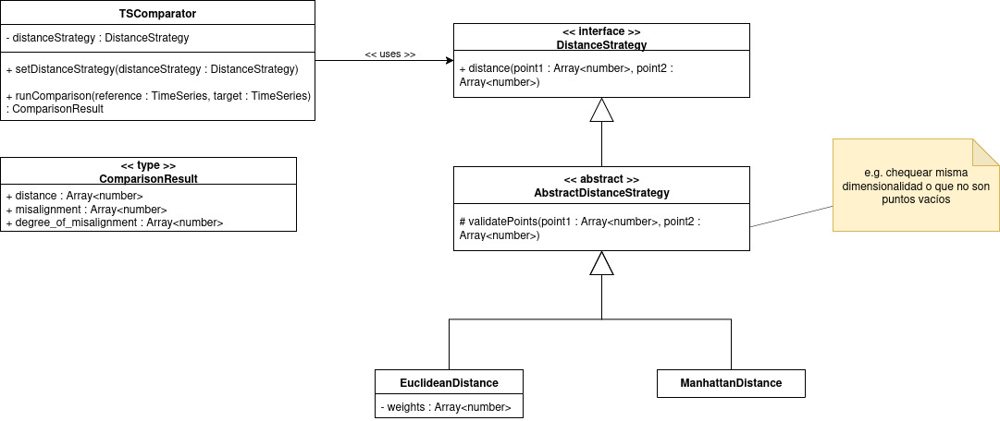

# TSComparator-ts
This project aims to be a Typescript implementation of a Dynamic-Time-Warping-based Time-Series comparison technique developed at the Universidad Nacional del Sur in Argentina.

## Implementation details
THe TSComparator class exposes the method _runComparison(reference, target)_ that takes two time series (i.e. two arrays of multidimensional points) and aims to compare them using the aforementioned technique.

Since many distance measures can be used for running the comparison, a Strategy Pattern approach has been proposed. The calculation of the distance between two multidimensional points has been delegated to the DistanceStrategy class. Different distance measures can be implemented by extending this interface and setting it to be used by the TSComparator.

## Class Diagram
A UML Class Diagram for the current state of development follows this explanation for ease of understanding

