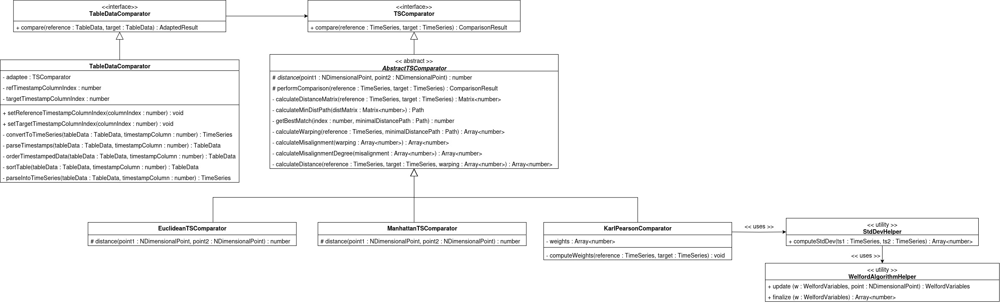
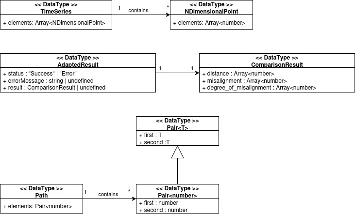

# TSComparator-ts
This project aims to be a Typescript implementation of a Dynamic-Time-Warping-based Time-Series comparison technique developed at the Universidad Nacional del Sur in Argentina.

## Implementation details

### TSComparator
THe TSComparator interface exposes the method _compare(reference : TimeSeries, target : TimeSeries)_ that takes two time series and compares them using the aforementioned technique. Each time-series (i.e. a TimeSeries object) is an array of N-Dimensional-Points, where each point is simply an array of numbers. In a time-series, all points are required to be dimensionally consistent (all points have the same dimensionality or number of variables) and both time-series must have the same dimensionality. This is validated and checked before carrying out the comparison.

This comparison method is based on the Dynamic-Time-Warping technique for comparing time-series. As such, a distance measure is needed to build an accumulated distance matrix. The use of different distance measures is achieved via inheritance. Different specific comparator classes implement different distance measures: Euclidean, Manhattan, Karl-Pearson comparators are available. Karl-Pearson distance is implemented using the Welford's algorithm for _online single-pass_ computation of the standard deviation of each variable in the two time-series.

### Adapter class
This project also includes an adapter class aimed at using the TSComparator interface and specific comparators in a React application to be found in the following GitHub repo: [Time-series-comparison](https://github.com/FacundoAlvarado9/time-series-comparison). This adapter class allows for the content of two data-tables, represented as rows of strings, to be compared.

### Tests
Tests can be found for the implemented classes in the _tests_ directory and their subdirectories. Tests can be carried out with the command
```
npm run test
```
Alternatively, to execute a single test file, for example, for testing the standard deviation calculation tests found in stddev.test.ts
```
npx jest 'stddev.test.ts'
```

## Class Diagram
A UML Class Diagram for the current state of development follows this explanation for ease of understanding



And for the types



## Sources
Urribarri, K., Larrea, M. (2022) A visualization technique to assist in the comparison of large meteorological datasets. _Computers & Graphics, Volume 104_, pages 1-10. https://doi.org/10.1016/j.cag.2022.02.011 